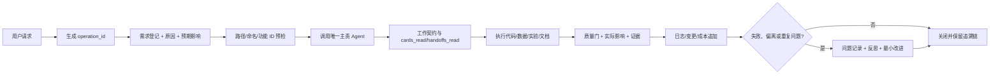

# AI4SCIENCE 治理要求对齐审计

## 1. 审计依据与范围

本审计复核 AI4SCIENCE 模板是否满足用户提出的七项治理要求，并检查整改后的规则、模板、校验器和现有文件之间是否一致。本轮只新增治理资产、补充模板和规则，不改名、不删除、不迁移历史文件，不执行全局 Skill 安装。

检查范围包括：

- `AGENTS.md`、`projectname/project/AGENTS.md`、`codex-project-kit/AGENTS.md` 及被工具包引用的 `AGENTS.template.md`；
- `projectname/project/PROGRAMMING_STANDARDS.md`、`pyproject.toml`、源代码、测试、脚本和目录；
- 全局 `ps-00` 至 `ps-08` 监理 Skill、生成脚本和模板；
- 全局科研 Agent 配置及上一份[工具包双日志与旧命名反思](/E:/zl/01-Project/AI4SCIENCE/projectname/achieve/00-项目管理/reflections/20260912-工具包双日志与旧命名-反思.md:1)；
- 当前 `projectname/achieve/00-项目管理` 中的需求、监督、日志、质量、变更、成本和反思记录。

限制：工程模板的 46 个 Python 源文件当前均为空白；没有真实科研成果卡、实验运行或项目级 Skill 可用于端到端行为验证。`uv run ruff check --no-cache src tests scripts benchmarks` 通过，但只说明静态规则可执行，不能证明功能契约完整。

## 2. 结论摘要

总体判定为 `CONDITIONALLY_ALIGNED`（有条件对齐）。本轮已将主要缺口落成可审计资产，但模板尚无真实功能条目、没有真实科研运行证据，且全局 Skill 安装仍需人工授权，因此不能宣称真实项目已完全通过：

1. 功能注册表和校验器已建立，但当前 `features` 为空，真实功能覆盖率须在项目实施时验证。
2. 日志模板已增加原因/预期影响/实际影响等字段，历史记录未批量改写，需新任务按新字段执行。
3. 工具包五个文档型本地 Skill、科研路由包和共享包已补齐随附中文模板。
4. Skill 晋升登记和只读审查器已建立；全局安装、哈希和回滚仍必须由用户批准并留证。
5. 稳定工程入口的固定名称例外已写入根级与工程级规则，日期化交付记录边界明确。

## 3. 偏差清单

| ID | 严重度 | 类型 | 需求引用 | 预期 vs 实际 | 证据 | 置信度 |
| --- | --- | --- | --- | --- | --- | --- |
| DRIFT-001 | 高 | `DESIGN_DRIFT` / `VERIFICATION_DRIFT` | REQ-01 | 已建立 `configs/features.yaml` 与 F001 校验器；当前无真实功能条目，覆盖率仍待项目实施 | `projectname/project/configs/features.yaml`、`scripts/f001_governance_validate.py` | 高 |
| DRIFT-002 | 中 | `DESIGN_DRIFT` | REQ-02 | 已将治理资产、工程根和空目录规则纳入只读校验；普通文件仍需按项目职责人工登记 | 根级 `AGENTS.md`、F001 输出 | 中 |
| DRIFT-003 | 高 | `VERIFICATION_DRIFT` | REQ-03、REQ-07 | 已补 `why/expected_impact/actual_impact/affected_* /decision_basis`；历史日志保持原样 | 全局 ps-00/ps-03 模板与 Skill、项目新日志模板 | 高 |
| DRIFT-004 | 中 | `SPECIFICATION_DRIFT` | REQ-04 | 已为工具包五个本地 Skill、科研路由包和共享包增加各自 `assets/output-template.md` | 各 Skill `assets/output-template.md` | 高 |
| DRIFT-005 | 中 | `SCOPE_DRIFT` / `DESIGN_DRIFT` | REQ-05 | 未删除历史占位；根级规则明确仅允许登记根目录、具体产物目录或历史 `.gitkeep` 占位 | 根级 `AGENTS.md`、F001 空目录检查 | 高 |
| DRIFT-006 | 中 | `DESIGN_DRIFT` / `VERIFICATION_DRIFT` | REQ-06 | 已建立 `skill-promotion.yaml` 与 F002 审查器；全局安装仍为人工授权步骤 | `configs/skill-promotion.yaml`、`scripts/f002_skill_promotion_audit.py` | 高 |
| DRIFT-007 | 中 | `SPECIFICATION_DRIFT` | REQ-01、REQ-04 | 已登记稳定技术入口固定名称例外，交付/日志/反思/API 说明仍日期化 | 根级、工程级 AGENTS 与命名管理规范 | 高 |
| DRIFT-008 | 中 | `VERIFICATION_DRIFT` | REQ-01 至 REQ-07 | 已增加 F001/F002 只读校验；科研成果卡和真实运行证据仍需项目实例产生 | 两个脚本及 API 说明 | 高 |

## 4. 双向追踪矩阵

| 要求/阶段门 | 规则或设计 | 实现/运行路径 | 验证证据 | 覆盖状态 |
| --- | --- | --- | --- | --- |
| REQ-01 文件和代码命名 | 根级命名矩阵；工程编程规范；固定入口例外 | `PROGRAMMING_STANDARDS.md`、Ruff、F001 | Ruff 通过；46 个源文件为空；F001 当前无 ERROR | 框架已覆盖，真实功能待验证 |
| REQ-01 功能编号 + 代码 + 功能 | `configs/features.yaml` 三元组注册契约 | F001 校验器 | 当前 `features=[]`，无重复项 | 框架覆盖 |
| REQ-02 新文件归属 | 根级 `research-project` 与 `project-supervision` 配置；工程文件选择表 | `ps_01/02/03` 可解析部分目标 | 生成器预览路径在项目根内 | 部分覆盖 |
| REQ-03 需求逐条记录 | `ps-01`、根级需求机制 | `requirements/` 生成器 | 本批需求记录已落盘 | 已覆盖（人工执行依赖） |
| REQ-03 操作日志 | `ps-03`、日志目录及 why/impact 字段 | `logs/` 生成器 | 本批日志已落盘；新模板含原因/影响 | 框架覆盖，历史记录未迁移 |
| REQ-03 问题反思 | `ps-04`、反思模板和触发器 | `reflections/` 生成器 | 双日志偏差已有反思 | 已覆盖（人工触发） |
| REQ-04 文档模板随 Skill | `ps-05`、各 Skill `assets/output-template.md` | 全局 Skill、工具包本地 Skill、SR 路由/共享包 | 已补齐本轮识别的文档型 Skill 模板 | 已覆盖（需持续扫描） |
| REQ-05 不建非具体目录 | 根级按需创建规则 | 现有 `.gitkeep`、空 `reflect/` | 目录扫描发现占位/空目录 | 部分覆盖 |
| REQ-06 项目 Skill 晋升全局 | `ps-05`、`ps-07`、晋升登记/审查器 | `skill-promotion.yaml`、F002 | 无待晋升项；全局安装未执行 | 框架覆盖，人工安装待授权 |
| REQ-07 日志理由和影响 | `ps-03` 模板及根级日志字段契约 | 全局模板、项目日志 | 已有独立字段，历史记录未改写 | 框架覆盖 |

## 5. 根因分析

| 根因 | 表现 | 影响 |
| --- | --- | --- |
| 规则分散且缺少单一元数据模型 | AGENTS、编程规范、工具包规则和监理 Skill 分别描述命名、归属、日志和 Skill | 同一文件可能满足文字规则，却无法被统一工具验证 |
| 关注输出目录多于功能身份 | 目录和文档命名较完整，功能 ID、需求 ID、测试 ID、代码模块没有统一关系 | 无法按功能追踪代码、测试、日志和成果 |
| 生成器只覆盖自身能生成的对象 | 治理文档、Skill、脚本有生成器，普通工程文件和科研产物没有统一注册校验 | 手工新建文件容易绕过归属、命名和日志闭环 |
| 工具包迁移资产与正式项目治理并存 | 工具包有自身 `log/`、模板和旧命名 | 审计者可能把来源资产误当正式项目状态 |
| 规则要求主动遵守而非系统强制 | 没有入口钩子或事务日志追加器 | 漏记需求、理由、影响或失败状态时只能事后发现 |

## 6. 最小修正计划与决策

| 时序 | 修正项 | 责任人 | 依赖/验证 | 回滚或恢复 |
| --- | --- | --- | --- | --- |
| 已完成 | 建立 `configs/features.yaml`：功能编号、功能代码、功能名称、需求、实现/测试路径、负责人、状态 | 项目监理 + 工程师 | F001 检查重复 ID、格式和必填字段 | 注册表版本化回滚 |
| 已完成 | 将日志模板扩展为 `why`、`expected_impact`、`actual_impact`、`affected_requirements`、`affected_files`、`affected_downstream`、`decision_basis` | 项目监理 | F001/F002 结果写入本批质量/日志记录 | 新旧模板并行，历史日志不改写 |
| 已完成 | 建立 F001 治理校验器和 F002 Skill 晋升审查器 | 项目监理 + 工程师 | `py_compile`、两个 `--check` 均退出 0 | 只读工具，无破坏性回滚需求 |
| 已完成 | 为工具包及 SR 路由/共享 Skill 增加各自中文 `assets/output-template.md` | Skill 维护人 | 路径/链接检查 | 保留集中旧模板作来源兼容 |
| 已完成 | 登记稳定工程文件名例外 | 项目架构师 + 项目经理 | 根级、工程级和命名规范一致 | 通过版本化规则恢复 |
| 待授权 | 执行项目 Skill 晋升链的全局安装、哈希记录和回滚演练 | 项目监理 + 用户 | 先填晋升登记，再独立审查/扫描和人工批准 | 保留项目级版本，不自动安装 |
| 延后 | 处理 `.gitkeep` 和空 `reflect/`：区分模板保留目录、具体实例目录和可删除空目录 | 项目建立责任人 | 需确认哪些目录是模板契约，禁止先删除 | 先生成目录清单，不立即删除 |
| 延后 | 在 Agent 入口或任务包装器中强制生成 `operation_id` 并追加日志 | 项目架构师 | 需评估 Codex 运行环境可接入点 | 保留人工调用作为降级方案 |

## 7. 建议的可控运行模型



每个功能的建议追溯链为：

```text
F001 功能身份
  -> REQ-* 需求
  -> ARCH/API/ADR 设计
  -> src/... 实现
  -> test_f001_* 测试
  -> operation_id 日志
  -> 成果卡/阶段 Gate
```

## 8. 决策所需信息

以下事项会改变全局能力或真实项目状态，不能由审计自动决定：

1. 是否批准某个项目 Skill 按登记证据进入全局安装阶段。
2. 真实项目首个功能条目的编号、代码和功能名是否符合团队命名约定。
3. 是否在未来接入自动日志入口或运行包装器；当前保留人工降级方案。

## 9. 整改后复核与运行证据

- `python scripts/f001_governance_validate.py --project-root . --check`：退出码 `0`，`ERROR=0`；当前仅有固定名/历史文档提示，已过滤虚拟环境和治理配置。
- `python scripts/f002_skill_promotion_audit.py --project-root . --check`：退出码 `0`；当前没有待晋升 Skill，全局安装未执行。
- `python -m py_compile scripts/f001_governance_validate.py scripts/f002_skill_promotion_audit.py`：退出码 `0`。
- 模板工程源文件仍为空白预留，以上结果只证明治理框架和脚本可执行，不证明科研功能实现、实验结果或阶段 Gate。

## 10. 审计交付边界

- 本轮已实施治理规则、模板、配置、只读校验器和 API 说明的最小整改；未改名、删除或迁移历史文件。
- 已区分事实、推断、未验证和待用户决定事项；全局 Skill 安装仍需明确授权。
- 本文档按 `YYYYMMDD-内容简述-对齐审计.md` 命名，存放在项目管理监督目录。
- 本文不证明具体科研项目通过任何阶段 Gate，也不证明空白模板中的功能已经实现。
