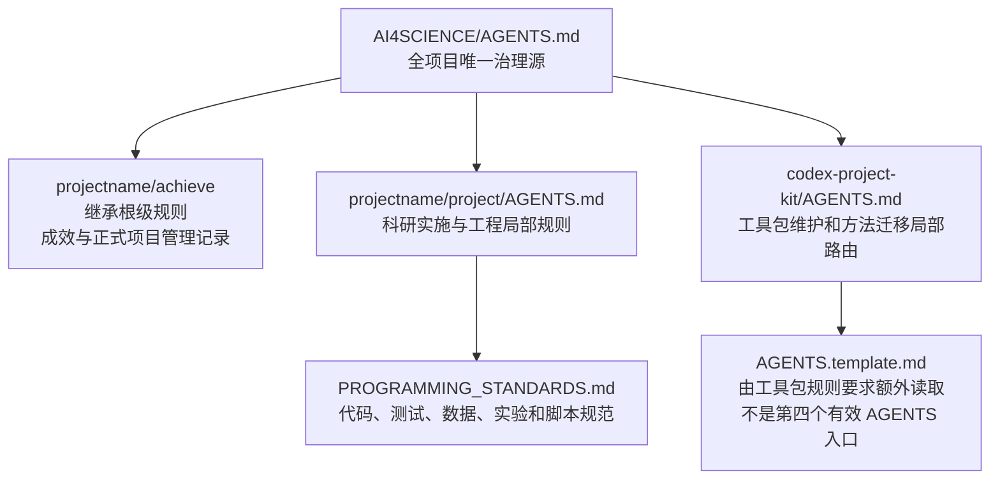
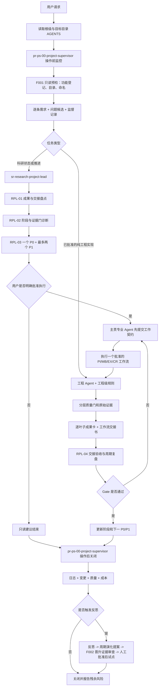

# AI4SCIENCE 项目治理与科研流程机制说明

## 1. 目的、范围与结论

### 1.1 目的

本文说明 AI4SCIENCE 模板如何具体实现需求登记、日志、反思、文件命名、文件归属、新 Skill 生成、三级规则协同、项目监管和十二个科研工作流，为后续派生项目提供可直接执行的操作依据。

### 1.2 检查范围

- 模板根级、工具包子目录和科研工程子目录内的三个有效 `AGENTS.md`。
- 根级 `project-supervision`、`research-project` 配置及项目编程规范。
- 全局项目监理 Agent、科研项目负责人 Agent、四个专业科研 Agent 及其共享流程契约。
- 项目监理的治理文档、项目级 Skill 和脚本工具生成器。
- 当前已经落盘的项目管理记录，以及整改后 F001/F002 只读校验结果。
- `projectname/project/configs/features.yaml`、`skill-promotion.yaml`、F001/F002 校验器及其中文 API 说明。
- 全局、工具包和 SR 路由/共享 Skill 的文档输出模板。

### 1.3 总体结论

项目监管和科研流程的主链已经形成，具体依靠“根级机器可解析配置 + 全局项目监理 Agent + 科研项目负责人 + 四个专业科研 Agent + 工程级局部规则 + 成效证据目录 + F001/F002 只读门禁”运行。它不是操作系统后台服务，也不是 Git 钩子；每次任务必须由执行 Agent 按根级规则主动调用监理，脚本负责路径、命名、功能登记、晋升证据、模板和拒绝覆盖等确定性约束。当前结论是“有条件对齐”：治理框架已经整改，真实派生项目的功能条目、科研成果卡和阶段 Gate 仍待实例化验证。

三个 `AGENTS.md` 不是每次都串行执行的三个总控。根级文件始终生效；进入 `projectname/project` 时叠加工程级文件；进入 `codex-project-kit` 时叠加工具包文件。工具包分支是历史方法和迁移资产的局部路由，不是正式科研项目台账或十二科研工作流的主入口。

## 2. 已核查证据

| 证据类别 | 项目相对路径或标识 | 检查内容 | 状态 |
| --- | --- | --- | --- |
| 根级治理 | `AGENTS.md` | 唯一监理配置、科研目录、Agent 路由、十二工作流、阶段门 | 已核查 |
| 工程规则 | `projectname/project/AGENTS.md` | 工程边界、父级回读、代码/数据/测试/运行归属 | 已核查 |
| 工具包规则 | `codex-project-kit/AGENTS.md` | 工具包内部建账、质量、日志、反思和迁移路由 | 已核查 |
| 工具包基线模板 | `codex-project-kit/AGENTS.template.md` | 工具包要求额外读取的通用工程基线 | 已核查，非独立生效的 `AGENTS.md` |
| 工程规范 | `projectname/project/PROGRAMMING_STANDARDS.md` | 代码、标识符、测试和工程文件规则 | 已纳入工程级约束 |
| 项目监管证据 | `projectname/achieve/00-项目管理/` | 需求、监督、质量、变更、日志和成本记录 | 已有实际文件 |
| 全局监管能力 | `pr-ps-00-project-supervisor`、`ps-00` 至 `ps-08` | 建账、质量、日志、反思、Skill/脚本和演化规则 | 已核查 |
| 科研编排能力 | `sr-research-project-lead` | RPL-01 至 RPL-04 | 已核查 |
| 专业科研能力 | 四个 `sr-*` 专业 Agent | PI、MB、EX、CR 共十二工作流 | 已核查 |
| 功能身份登记 | `projectname/project/configs/features.yaml` | 编号、代码、功能名、责任、实现路径、测试路径和状态 | 已建立，模板当前无真实功能条目 |
| Skill 晋升登记 | `projectname/project/configs/skill-promotion.yaml` | 试点、评审、安全扫描、批准、安装和回滚证据 | 已建立，无待晋升项 |
| 治理校验器 | `projectname/project/scripts/f001_governance_validate.py`、`f002_skill_promotion_audit.py` | 功能/目录/命名和 Skill 晋升证据的只读检查 | 两个脚本试运行退出码均为 0 |
| 生成器试运行 | 三个 `ps_0*_create_*.py` | 反思、新文档类型、新 Skill、新脚本目标路径 | 预览通过，未写入示例产物 |

## 3. 总体治理架构

### 3.1 三个有效 `AGENTS.md` 的作用域



| 工作位置 | 实际读取规则 | 主要结果去向 |
| --- | --- | --- |
| 模板根或 `projectname/achieve` | 根级 `AGENTS.md` | 正式项目治理与科研成效 |
| `projectname/project` 及其子目录 | 根级 `AGENTS.md`，再读工程级 `AGENTS.md` 和编程规范 | 工程证据留在 `project`；科研成效写入 `achieve` |
| `codex-project-kit` 及其子目录 | 根级 `AGENTS.md`，再读工具包 `AGENTS.md` 和其指定模板/方法文件 | 工具包自身维护材料；正式项目记录仍服从根级监理配置 |
| 同时改动两个子树 | 根级规则 + 每个目标子树自己的局部规则 | 分别按目标责任落盘，并由根级监理统一记录 |

### 3.2 规则优先级

1. 当前用户明确要求和平台安全规则优先。
2. 根级 `AGENTS.md` 定义全项目不可取消的监管、科研和归档规则。
3. 子目录 `AGENTS.md` 只能补充或收紧本子域规则，不能取消根级需求、日志、反思、命名、证据和人工 Gate。
4. 工程编程规范继续细化语言、模块、测试和运行约束。
5. 规则冲突时停止冲突分支，由项目监理登记；科研影响由科研项目负责人判断，目录或治理基线由项目建立责任人或用户决定。

## 4. 需求记录机制

### 4.1 何时记录

每次新请求、追加要求、范围变化、撤回、冲突或继续未完成任务，在专业工作开始前都要调用 `pr-ps-00-project-supervisor`。监理使用 `pr-ps-01-project-governance` 将用户要求拆成原子需求，不允许只保留一条宽泛摘要。

### 4.2 记录什么

每项需求至少包含稳定需求 ID、提出日期、原意、来源、优先级、范围、非目标、验收标准、状态、影响对象和关闭决定。记录必须区分：

- 用户明确要求；
- 项目证据事实；
- Agent 可逆推断；
- 需要用户决定的未知项。

会改变范围、架构、成本、权限或验收的推断不能直接执行。需求修改采用追加和关联方式，不覆盖历史记录。

### 4.3 如何落盘

根级配置将正式需求目录解析为：

```text
projectname/achieve/00-项目管理/requirements/
```

治理文档生成器读取根级 `project-supervision` 配置，从中文空白模板生成 `YYYYMMDD-内容简述-需求记录.md`。目标已存在时拒绝覆盖。当前目录已经存在实际需求记录，证明该路径和生成机制可用。

## 5. 日志机制

项目中存在三种不同日志，不能混用。

| 日志层 | 回答的问题 | 负责人/机制 | 位置 | 状态 |
| --- | --- | --- | --- | --- |
| 项目监管事实日志 | 本次实际做了什么、改了什么、如何验证、还有什么风险 | `pr-ps-00-project-supervisor` + `pr-ps-03-project-logging` | `projectname/achieve/00-项目管理/logs/` | 正式项目台账，已实际落盘 |
| 工程运行日志 | 某次数据、训练、评估或推理运行发生了什么 | 工程实现中的 Reporter、tracking、ArtifactWriter 和 `run_id` | `projectname/project` 内批准的运行/产物目录 | 由具体实现和运行产生 |
| 工具包维护日志 | `codex-project-kit` 自身迁移和维护做了什么 | 工具包局部治理规则 | `codex-project-kit/log/` 及固定 `CHANGELOG.md` | 仅用于工具包，不替代正式项目台账 |

### 5.1 正式项目日志的触发与内容

每个原子动作或运行批次结束后记录任务/需求 ID、目标、实际动作、改动路径、命令、结果、证据、未执行项、阻塞、成本时间、残余风险和下一步。日志还必须独立填写 `why`、`expected_impact`、`actual_impact`、`affected_requirements`、`affected_files`、`affected_downstream` 和 `decision_basis`。目标不能替代原因，结果不能替代影响；事实、推测和未执行项分栏记录。失败、跳过和阻塞也必须记录，不能只记录成功。

日志只写观察到的事实。没有可靠计时、费用、测试或发布证据时写“未采集”或“未执行”，不得估算成事实。用户可见变化同步进入 `changes/`，可观测成本同步进入 `costs/`，检查结果进入 `quality/`。

### 5.2 实现方式

`ps_01_create_governance_document.py --type log` 根据根级配置选择 `logs/` 和中文模板，默认仅预览，增加 `--write` 才写入；同名文件存在时拒绝覆盖。全局 Agent 和全局 Skill 不保存具体项目日志。全局 `ps-00`、`ps-03` 模板已同步增加原因/影响字段，项目日志实例在本次整改中已补填实际原因、预期影响和实际影响。

### 5.3 工程运行日志的边界

工程级规则要求所有事件、指标、模型、表格和图表使用同一 `run_id`，失败、取消和中断保留真实终态。工程运行日志是科研成果卡引用的原始证据，不直接等于项目管理日志，也不自动证明科学结论。

## 6. 问题与反思机制

### 6.1 问题先登记

用户指出的问题、实际运行错误、测试失败、工具异常、流程遗漏和重复返工首先进入问题/监督记录。至少记录问题 ID、复现条件、期望、实际、影响、严重度、证据、临时处置、根因状态、负责人和关闭证据。环境阻塞不能未经判断写成产品缺陷。

### 6.2 反思触发条件

满足以下任一条件才调用 `pr-ps-04-reflection-loop`：

- 用户明确指出问题或要求复盘；
- 出现确认缺陷、回归或质量门禁阻塞；
- 同类错误重复；
- 需求、规则、科研设计或实现发生偏离；
- 出现有证据的显著返工。

一般成功只写日志，不自动生成反思，也不自动修改 Skill。

### 6.3 反思内容与位置

反思区分需求、流程、规则、实现、数据和环境根因，一次最多提出三项最小改进，并写明证据、责任人、验证、试点、权限和回滚。文件名为 `YYYYMMDD-内容简述-反思.md`，目标目录为：

```text
projectname/achieve/00-项目管理/reflections/
```

已存在工具包双日志与旧命名反思。本次根据对齐审计确认多个治理缺口后，已按触发规则生成 `20260912-治理审计整改-反思.md`，记录根因、影响、最小改进和后续周期复核；历史反思不覆盖，规则升级仍需人工批准。

### 6.4 从反思到规则演化

根级配置设置 `evolution_review_days = 14`、`repeat_problem_threshold = 3`。到期或达到阈值后，`pr-ps-08-evolution-review` 汇总需求变化、问题、反思、质量、成本、重复失败和误触发，形成技能提案。只有跨多次证据支持、边界清楚、维护人明确且人工批准的提案才能试点；监理不能自动修改全局 Skill 或项目基线。

## 7. 所有已登记文件类型的命名规范

命名先确定责任和目录，再确定文件名。

| 文件类型 | 命名规则 | 主要说明 |
| --- | --- | --- |
| 管理、技术、科研文档 | `YYYYMMDD-内容简述-文档类型.扩展名` | 生产日期置前，不覆盖较早版本 |
| 需求记录 | `YYYYMMDD-内容简述-需求记录.md` | 稳定需求 ID 写入正文或元数据 |
| 监督记录 | `YYYYMMDD-内容简述-监督记录.md` | 记录范围、权限、路径、验证和结论 |
| 项目日志 | `YYYYMMDD-内容简述-日志.md` | 同日多批次以稳定运行 ID 或不同简述区分 |
| 反思 | `YYYYMMDD-内容简述-反思.md` | 必须有事实证据和最小改进 |
| 变更记录 | `YYYYMMDD-内容简述-变更记录.md` | 固定 `CHANGELOG.md` 属工具链例外 |
| 质量门禁 | `YYYYMMDD-内容简述-质量门禁.md` | 记录 L1 至 L5 适用状态 |
| 成本时间 | `YYYYMMDD-内容简述-统计.md` | 缺失数据明确写未采集 |
| 模板 | `YYYYMMDD-内容简述-模板.md` | 正文必须是中文空白结构，不含具体项目事实或参考文档名 |
| 文档类型登记 | `YYYYMMDD-内容简述-文档类型登记.md` | 新文档类型必须先登记再产出 |
| API 说明 | `YYYYMMDD-工具或接口简述-API说明.md` | 与新脚本同批生成 |
| 科研成果卡 | `YYYYMMDD-成果简称-成果卡.md` | SR ID 位于 frontmatter，不使用 SR ID 作为文件名前缀 |
| 科研交接书 | `YYYYMMDD-工作简述-交接书.md` | 同日多份使用不同明确简述，禁止覆盖 |
| Notebook | `YYYYMMDD-内容简述-实验或分析.ipynb` | 必须可定位输入、环境与结论边界 |
| 图表/截图 | `YYYYMMDD-对象-视图或状态-证据.格式` | 单张图不能独立证明科学结论 |
| 数据文件 | `数据集或对象-分区或范围-版本.格式` | 避免空格、机器路径，另记来源和许可 |
| 配置文件 | 项目既有工具固定名；新通用配置使用 `snake_case` 或已批准框架约定 | 配置中的 Schema、版本、敏感字段和兼容性需登记 |
| Schema/契约 | `领域_对象_v主版本.格式` | 例如版本化 JSON Schema |
| 运行产物 | `run_id/对象-阶段-版本.格式` | 所有相关证据共享稳定 `run_id` |
| 模型/检查点 | `模型-阶段或步数-版本.格式` | 配套 manifest 和哈希 |
| Python 模块/脚本 | `snake_case.py` | 名称表达单一责任 |
| Python 类/异常 | `PascalCase`，异常以 `Error` 结尾 | 按工程规范进一步收紧 |
| Python 函数/变量 | `snake_case` | 函数优先使用动作动词 |
| Python 常量 | `UPPER_SNAKE_CASE` | 不使用含糊缩写 |
| Python 测试 | `test_行为或对象.py` | 测试名称描述可观察行为 |
| 迁移脚本 | `序号_动作_对象.py` 或框架固定格式 | 必须有迁移和回滚规则 |
| Skill 目录和 name | `代号-英文技能名称` | 小写字母、数字、连字符，完整名称不超过 64 字符 |
| Skill 入口 | 固定 `SKILL.md` | frontmatter `name` 与目录一致 |
| Skill 接口元数据 | 固定 `agents/openai.yaml` | 工具链固定名例外 |

所有功能性文件还必须绑定功能三元组：`feature_id`（如 `F001`）、`feature_code`（大写稳定代码）和 `feature_name`（中文功能名），并在 `configs/features.yaml` 登记责任人、实现路径、测试路径和状态。Python 文件名及类、函数、变量继续遵循语言规范；三元组通过注册表、模块 docstring 或相邻契约追踪，避免破坏导入规则。F001 校验重复、格式、必填字段、治理资产和未登记空目录；固定技术入口（如 `docs/api.md`、`docs/architecture.md`）仅豁免日期化文件名，不豁免归属、版本、日志和验证。

`AGENTS.md`、`README.md`、`SKILL.md`、`pyproject.toml`、`openai.yaml`、`__init__.py`、`CHANGELOG.md`、`Dockerfile`、`.gitignore`、`LICENSE`、`CITATION.cff`、`SECURITY.md`、`CONTRIBUTING.md`、锁文件等工具链或生态固定名称是例外。例外只免除日期化文件名，不免除目录、正文、变更和验证要求。

上表覆盖当前治理规则已经登记的文件类型。以后出现未列类型时，不能自行类推后直接创建；必须先登记用途、负责人、扩展名、命名、目录、模板、证据、敏感性、保留和验证规则。文档型文件还必须先建立中文空白模板。

工具包中现存的 `skills/templates/daily-log.md`、`reflection-report.md`、`transfer-log.md` 和 `log/migration-2026-09-11.md` 属迁移前的历史命名。它们可作为来源证据或工具包内部资产，但不应直接复制为新项目的正式输出；新输出必须采用根级日期化规则。

## 8. 新文件去处归属

### 8.1 正式项目管理文件

以下目录全部位于 `projectname/achieve/00-项目管理/`，由根级配置解析，不在 Agent 或脚本中写死绝对路径。

| 文件责任 | 子目录 |
| --- | --- |
| 用户需求 | `requirements/` |
| 操作监督、放置决定、机制说明 | `supervision/` |
| 事实日志 | `logs/` |
| 问题反思 | `reflections/` |
| 用户可见变更 | `changes/` |
| 质量门禁 | `quality/` |
| 成本时间 | `costs/` |
| Skill 提案、说明和演化评估 | `skills/` |
| 脚本工具 API 说明 | `tools/` |
| 新文档类型登记和项目级通用模板 | `templates/` |

### 8.2 科研成效文件

科研成果卡按 SR-01 至 SR-68 的主题进入 `projectname/achieve` 下八类目录：

| SR 范围 | 目录 |
| --- | --- |
| SR-01 至 SR-06 | `01-研究问题与选题/` |
| SR-07 至 SR-14 | `02-文献调研与领域结构/` |
| SR-15 至 SR-21 | `03-Idea科学假设与创新点/` |
| SR-22 至 SR-29 | `04-技术方案与方法设计/` |
| SR-30 至 SR-40 | `05-实验设计与执行/` |
| SR-41 至 SR-48 | `06-结果分析与问题诊断/` |
| SR-49 至 SR-58 | `07-论文与成果表达/` |
| SR-59 至 SR-68 | `08-项目推进与下一步计划/` |

工作流交接书进入相应主题目录下的 `PI-E01`、`PI-X01`、`PI-P01`、`MB-E01`、`MB-X01`、`MB-P01`、`EX-E01`、`EX-X01`、`EX-P01`、`CR-E01`、`CR-X01` 或 `CR-P01` 子目录。目录只在首份真实产物出现时创建。

### 8.3 科研实施和工程文件

| 新文件责任 | `projectname/project` 下位置 |
| --- | --- |
| 算法实现 | `src/ai_project/algorithms/领域/名称/` |
| 训练、评估、推理编排 | `src/ai_project/application/` |
| 数据格式、加载和校验 | `src/ai_project/data/` |
| 指标与结果报告逻辑 | `src/ai_project/evaluation/` |
| 图表生成逻辑 | `src/ai_project/visualization/` |
| 运行事件和追踪 | `src/ai_project/tracking/` |
| manifest 和产物存储逻辑 | `src/ai_project/artifacts/` |
| Python 公共 API | `src/ai_project/api.py` 及包级导出 |
| CLI / HTTP 入口 | `src/ai_project/cli/`、`src/ai_project/server/` |
| 测试和小型 fixture | `tests/` 及 `tests/regression/fixtures/` |
| 算法和接口文档 | `docs/algorithms/`、`docs/api.md`、架构/ADR 既有位置 |
| Notebook | `notebooks/` |
| 性能测试 | `benchmarks/` |
| 项目脚本工具 | `scripts/` |
| 项目级 Skill | `.codex/skills/代号-英文技能名称/` |

不能确定位置时先做文件放置决定，不能创建通用 `utils.py`、`helpers.py`、`common.py` 或第二套入口。真实数据、下载缓存、敏感信息和生成模型不得因方便直接提交到仓库。

## 9. 新 Skill 生成规则及实际实现

### 9.1 允许提出 Skill 的条件

只有问题或需求具有重复性、现有 Skill 无法覆盖、规则可迁移、输入输出和失败边界清楚、收益可测且维护人明确时，才进入候选。单次成功、单个项目特例或个人偏好不能直接升级为 Skill。

### 9.2 生成前置步骤

1. 由监理登记触发需求、问题和证据。
2. 调用 `pr-ps-08-evolution-review` 或 `pr-ps-05-skill-authoring` 形成技能提案。
3. 检查代号在项目内唯一，明确职责、触发、非目标、权限、幂等、维护人、验证和回滚。
4. 用户批准候选或试点范围后，才能实际写入。

### 9.3 生成器约束

项目级生成器要求：

- 代号符合“小写字母/数字 + 两位序号”，例如 `ds-01`；
- 英文技能名称使用 kebab-case；
- 完整目录名和 frontmatter `name` 为 `代号-英文技能名称`，不超过 64 个字符；
- `--project-root` 必须指向包含唯一根级 `AGENTS.md` 的项目根；
- 默认仅预览，`--write` 才写入；任何目标冲突都会整体拒绝覆盖；
- 所有目标路径必须留在项目根内。

本次预览证明一个文档型项目 Skill 会同时规划生成：

```text
projectname/project/.codex/skills/〔代号-英文技能名称〕/SKILL.md
projectname/project/.codex/skills/〔代号-英文技能名称〕/agents/openai.yaml
projectname/project/.codex/skills/〔代号-英文技能名称〕/assets/YYYYMMDD-内容简述-输出模板.md
projectname/achieve/00-项目管理/skills/YYYYMMDD-内容简述-技能说明.md
```

文档输出模板必须是中文空白结构，并由 `SKILL.md` 明确选择规则和项目内落点。生成器只产生候选骨架，不能证明 Skill 已实现或可默认启用。

模板随 Skill 版本维护，不另设与 Skill 脱节的模板目录：本轮已为工具包的治理、质量、反思、Skill 编写和迁移 Skill，以及全局 SR 路由/共享 Skill 补齐中文 `assets/output-template.md`。项目实例化 Skill 时，模板必须随 `SKILL.md`、接口元数据和项目管理说明一并评审。

### 9.4 验证和升级

候选 Skill 必须验证正常、边界、无效输入、失败、重复执行、权限和误触发。项目级晋升证据登记在 `configs/skill-promotion.yaml`，由 `scripts/f002_skill_promotion_audit.py` 只读检查试点、独立评审、安全扫描、人工批准、全局安装和回滚证据；当前无待晋升项。独立评审和人工批准后，才能成为默认项目能力；由项目级提升为全局能力仍需另一次明确批准，不能由监理自动完成。

## 10. 新脚本工具和新文档类型

### 10.1 新脚本工具

新脚本必须用于可重复、确定性的项目操作，不把一次性命令包装成无人维护的工具。Python 脚本使用 `snake_case.py`；治理校验器可在该规范前增加已登记的功能前缀（如 `f001_governance_validate.py`），且必须与功能三元组对应。所有脚本路径参数化，默认预览，不隐式联网、读取凭据、覆盖、提交、推送或发布。

脚本生成器在同一批次规划：

```text
projectname/project/scripts/〔snake_case名称或 fNNN_snake_case 名称〕.py
projectname/achieve/00-项目管理/tools/YYYYMMDD-内容简述-API说明.md
```

API 说明至少包含版本、责任人、源文件、用途、调用、参数、输入输出、退出码、错误、安全、幂等、并发、示例、测试、兼容、变更和回滚。脚本骨架默认返回未完成状态；补齐实现、API 和验证前不能关闭任务。

本轮已落地的确定性工具为 `scripts/f001_governance_validate.py`（功能/目录/命名门禁）和 `scripts/f002_skill_promotion_audit.py`（Skill 晋升证据门禁），对应 API 说明位于 `achieve/00-项目管理/tools/`。二者均为只读检查，不执行全局安装、提交、推送或发布。

### 10.2 新文档类型

现有模板不能表达新文档时，先在 `templates/` 生成 `YYYYMMDD-内容简述-文档类型登记.md`，定义用途、负责人、扩展名、命名、落点、字段、证据、保留、敏感性、验证和归档；再建立中文空白模板，最后才生成正式文档。本说明已按这一顺序建立“项目治理机制说明”类型和模板；新脚本 API 说明位于 `achieve/00-项目管理/tools/`，新 Skill 的输出模板与 `SKILL.md` 同目录的 `assets/` 一起维护。

## 11. 三个 `AGENTS.md` 如何配合运行

### 11.1 根级 `AGENTS.md`

它是唯一全项目治理源，负责：

- 解析 `projectname/project`、`projectname/achieve` 和 `00-项目管理`；
- 强制每次操作前后调用 `pr-ps-00-project-supervisor`；
- 路由科研项目负责人和四个专业科研 Agent；
- 定义十二个科研工作流、成果卡、交接书、八类成效目录和三个阶段门；
- 定义日期化命名、新 Skill/脚本、反思阈值和关闭条件；
- 解析 `configs/features.yaml`、`configs/skill-promotion.yaml`，并要求 F001/F002 只读门禁在交付前留下证据。

### 11.2 工程级 `projectname/project/AGENTS.md`

它显式先读取 `../../AGENTS.md`，不再定义第二套 `project-supervision`。它负责：

- 代码模块、数据边界、算法实现、运行、产物、测试和文档的局部位置；
- 要求读取 `PROGRAMMING_STANDARDS.md`；
- 规定工程验证命令和交付检查；
- 要求新增功能先登记功能三元组和实现/测试路径，完成后运行 F001/F002 校验；
- 保证工程证据留在 `project`，成果卡和交接书写入 `../achieve`；
- 禁止工程 Agent 自行修改研究问题、实验设计、数据纳入或论文主张。

### 11.3 工具包级 `codex-project-kit/AGENTS.md`

它只在维护或迁移工具包时追加生效，负责路由工具包内部 `.codex/skills/`、`skills/methods/`、`skills/governance/`、`TODO.md`、`log/` 和 `CHANGELOG.md`。它要求读取 `AGENTS.template.md`，后者只是被引用的基线模板，不是第三层之外的第四个自动入口。

工具包规则的局部日志和旧模板不能覆盖根级正式项目管理机制。工具包内的文档型 Skill 必须把中文空白模板放在各自 `assets/`，并由 `SKILL.md` 引用；若在工具包内产生会影响真实项目的规则、Skill 或脚本，应通过迁移试点和根级监理重新登记，不能直接复制到 `projectname/project` 或全局目录。

### 11.4 典型任务读取顺序

| 任务 | 读取/调用顺序 |
| --- | --- |
| 检查项目状态 | 根级 AGENTS -> pr-ps-00-project-supervisor -> 科研负责人 RPL-01/02/03 |
| 修改科研工程代码 | 根级 AGENTS -> 工程级 AGENTS -> 编程规范 -> pr-ps-00-project-supervisor -> 已批准科研工作流/工程 Agent |
| 运行实验 | 根级 AGENTS -> 工程级 AGENTS -> pr-ps-00-project-supervisor -> 科研负责人授权 -> 实验员工作流 -> 工程运行与证据 |
| 维护工具包 | 根级 AGENTS -> 工具包 AGENTS -> AGENTS.template -> 工具包指定方法/治理文件 -> 根级监管关闭 |
| 从工具包迁移能力 | 根级 AGENTS -> 工具包迁移规则 -> 小范围试点 -> 质量门 -> 人工批准 -> 项目级 Skill/脚本目标目录 |

## 12. 如何完成项目监管与科研流程

### 12.1 端到端流程



### 12.2 十二科研工作流

| 阶段 | 工作流顺序 | 主责结果 |
| --- | --- | --- |
| Explore | PI-E01 -> MB-E01 <-> CR-E01 -> EX-E01 -> PI-X01 Gate F | 问题、范围、文献/假设、批判挑战、最小证伪和研究设计冻结 |
| Execute | MB-X01 -> EX-X01 -> CR-X01 -> PI-X01 结果证据门 | 实现契约、正式实验、完整性诊断、资源/主张/路线决定 |
| Express | EX-P01 + MB-P01 -> PI-P01 草稿 -> CR-P01 -> PI-P01 修改/交付/归档 | 分析图表、可复现写作、独立审稿、受证据约束的最终主张 |

评审失败或 Gate 未通过时退回责任工作流。后期论文、图表或代码存在不能证明前期 Gate 已通过。每个关闭的 SR 叶子任务独立生成成果卡，禁止一个工作流只生成一张聚合成果卡。

### 12.3 四个项目负责人步骤

1. `RPL-01`：同时遍历 `project` 和 `achieve`，建立非重复证据账本，报告断链、冲突和来源不明材料。
2. `RPL-02`：以最早未通过的关键依赖判断主阶段；没有具名人工裁决的 `accepted` 降为 `partial`。
3. `RPL-03`：只给一个 P0、最多两个 P1，并写出 Agent、工作流、叶子 Skill、输入、产物、完成标准、人工检查点和停止条件。
4. `RPL-04`：专业 Agent 返回后核验成果卡、原始证据、六项交接字段和人工决定，再决定是否改变阶段或下一工作。

项目负责人默认只读。只有用户明确说“执行、派发或按建议推进”才进入编排模式，而且一次授权不能自动跨越后续高成本、外部写入或科学判断节点。

### 12.4 三类 Gate

| Gate | 最低证据 | 必要人工决定 |
| --- | --- | --- |
| Explore 关闭 | PI-E01、MB-E01、CR-E01、EX-E01 的适用成果卡和交接 | 研究问题、范围、假设、创新点和研究设计冻结 |
| Execute 关闭 | MB-X01、EX-X01、CR-X01、PI-X01 的运行、偏差、审计和路线证据 | 数据纳入、资源、异常处理、统计/机制解释和主张边界 |
| Express 关闭 | EX-P01、MB-P01、CR-P01、PI-P01 的分析、写作、独立评审和修订 | 合作署名、投稿、专利、开源、公开发布和最终验收 |

## 13. 具体调用方式

### 13.1 只读判断项目进度

```text
先调用 pr-ps-00-project-supervisor 登记只读检查。
再调用 sr-research-project-lead，以 projectname 为项目容器，
projectname/project 为实施目录，projectname/achieve 为成效目录，
依次执行 RPL-01、RPL-02、RPL-03；只读，不调用其他 Agent，所有结论引用项目相对证据路径。
```

### 13.2 执行已经批准的科研 P0

```text
调用 sr-research-project-lead，按已批准 P0 进入编排模式。
只派发指定专业 Agent 和一个工作流，要求先返回工作契约；
在人工检查点暂停，收到成果卡和交接书后执行 RPL-04，不自动启动下一工作流。
```

### 13.3 专业 Agent 派发契约

```text
调用〔实际 Agent 名称〕，执行〔工作流编号〕。
实施目录为 projectname/project，成效目录为 projectname/achieve。
本轮唯一目标为〔目标〕，仅调用〔必要 SR 叶子 Skill〕。
先读取〔成果卡路径〕和〔交接书路径〕，再提交工作契约；
契约记录 cards_read、handoffs_read、交付物、完成标准、人工检查点和停止条件。
```

### 13.4 工程实现

```text
先读取根级和 projectname/project/AGENTS.md、PROGRAMMING_STANDARDS.md。
在已批准科研工作契约范围内调用工程 Agent；代码、测试、配置和运行证据写入 projectname/project，
科研结论、成果卡和交接书写入 projectname/achieve，并用相对路径连接两者。新增功能先在
`configs/features.yaml` 登记功能三元组，完成后运行 `scripts/f001_governance_validate.py --project-root . --check`；
涉及 Skill 晋升时追加 `scripts/f002_skill_promotion_audit.py --project-root . --check`。操作结束必须把原因、预期影响、实际影响和下游影响写入项目日志。
```

## 14. 检查发现、限制与风险

| 编号 | 检查项 | 当前状态 | 证据 | 限制或风险 | 建议处置 |
| --- | --- | --- | --- | --- | --- |
| F-01 | 根级监管配置 | 已实现 | 两个配置块可解析，治理生成器已实际写入记录 | 派生项目必须替换 `projectname` | 建立项目时首先复核配置 |
| F-02 | 需求、日志、质量、变更、成本 | 已实现并有实例 | `projectname/achieve/00-项目管理/` | 依赖每次任务主动调用监理，不是后台强制钩子 | 把监理入口保留为每次任务第一步 |
| F-03 | 反思机制 | 已实现并产生整改反思实例 | `reflections/20260912-工具包双日志与旧命名-反思.md`、`reflections/20260912-治理审计整改-反思.md` | 改进尚待人工批准 | 不自动修改规则或升级 Skill |
| F-04 | 新 Skill 生成 | 规则、生成器和随附模板已实现，当前项目无待晋升 Skill | 工具包/全局 Skill 的 `assets/output-template.md` 及生成器预览 | 骨架不是可用 Skill，晋升仍需证据和人工批准 | 以具体需求做项目级试点并登记晋升证据 |
| F-05 | 新脚本及 API | F001/F002 已实现并通过语法、Lint 和试运行 | `scripts/f001_governance_validate.py`、`scripts/f002_skill_promotion_audit.py` 及 `tools/*API说明.md` | 当前仅验证模板项目，未证明派生项目覆盖完整 | 首个真实项目执行并保存退出码与日志 |
| F-06 | 根级与工程级协同 | 已接通 | 工程文件显式回读根级且无第二监理配置 | 真实项目改目录后需同步相对路径 | 初始化时做路径检查 |
| F-07 | 工具包局部路由 | 可用但与正式监管并存 | 工具包有独立 `log/TODO/CHANGELOG` 和旧模板 | 容易误把工具包内部日志当正式台账，旧命名不符合新规则 | 明确其仅为来源/迁移资产；正式输出回到根级配置目录 |
| F-08 | 科研十二工作流 | 路由与证据门已定义 | 根级规则和五个科研 Agent | 当前 `achieve` 尚无真实科研成果卡，未做真实项目端到端演练 | 首个真实项目先执行只读 RPL-01 至 RPL-03 |
| F-09 | 功能身份与文件归属 | 已建立注册表和只读预检 | `configs/features.yaml`、F001 输出 | 模板注册表尚无真实功能条目 | 每个派生项目首个功能先登记三元组并补实现/测试路径 |
| F-10 | 全局能力晋升 | 规则已建立，当前未执行安装 | `configs/skill-promotion.yaml`、F002 输出 | 不能把项目级试点自动变成全局 Skill | 具备完整证据后再由用户明确批准全局安装 |

## 15. 结论边界与待决定事项

本次可以确认规则、路径、生成器、随附模板、功能注册表、F001/F002 只读校验器和 Agent 路由已经落地，治理文档与反思生成路径已实际工作；不能据此声称具体科研项目已经通过任何科研 Gate，也不能声称模板项目已经覆盖真实派生项目的所有功能、成果卡或运行数据。

建议用户审核并决定两项：

1. 是否选择一个真实派生项目执行一次 RPL-01 至 RPL-03 只读演练，并登记首个功能三元组，验证十二工作流在真实成果卡和工程证据上的端到端可用性。
2. 是否在完成项目级 Skill 试点、独立评审、安全扫描、人工批准和回滚准备后，授权将指定 Skill 晋升为全局能力；未授权前维持项目级隔离。

## 16. 变更记录

| 版本 | 日期 | 变更摘要 | 责任人 | 状态 |
| --- | --- | --- | --- | --- |
| v1.0 | 2026-09-12 | 首次核查并说明治理、科研流程、三个 AGENTS 协同及当前限制 | 项目监理、项目经理 | 待用户审核 |
| v1.1 | 2026-09-12 | 根据治理对齐审计补齐功能注册表、原因/影响日志字段、Skill 随附模板、晋升审查、固定技术文件例外及 F001/F002 验证证据 | 项目监理、项目经理 | 待用户审核 |
