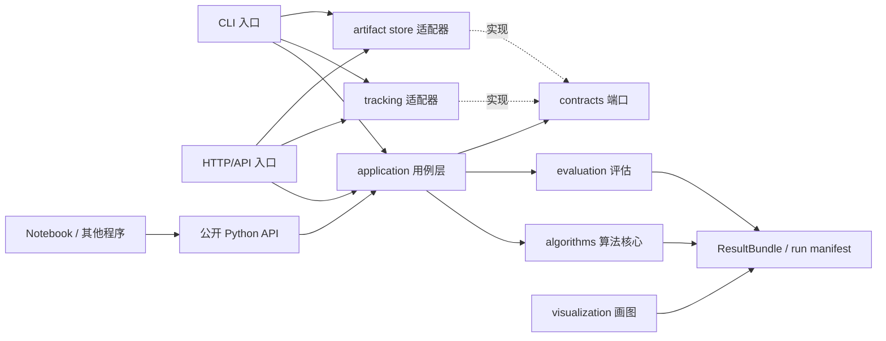

# 开源人工智能项目目录与算法接口设计方案

| 文档项         | 内容                                                                             |
| -------------- | -------------------------------------------------------------------------------- |
| 文档 ID / 版本 | `ARCH-AI-LAYOUT-001` / `0.1`                                                     |
| 状态           | 建议稿，尚未批准或实施                                                           |
| 日期 / 编码    | 2026-09-10 / UTF-8                                                               |
| 适用范围       | 可复用的 Python AI/科学算法项目；附 OpenScience 现有仓库的渐进采用建议           |
| 决策人         | 项目维护者，待指定                                                               |
| 需求基线       | 用户提出的日志、算法、测试、入口、画图分离，以及算法可被测试、画图和其他程序调用 |

## 1. 结论

推荐采用“**可导入算法库 + 薄应用入口 + 独立运行产物**”的模块化单体，而不是按训练脚本堆文件，也不需要一开始拆成微服务。

核心规则只有四条：

1. `src/<package>/algorithms` 只负责算法，不解析命令行、不启动 Web、不选择日志目录、不直接画图。
2. 测试、CLI、HTTP 服务、Notebook 和画图都调用同一个 `application`/`api` 层，不能各自复制训练流程。
3. 算法返回有版本的结构化结果；画图读取结果和指标，不读取算法对象的私有成员，也不要求重新训练。
4. 日志、指标、模型、检查点和图像按 `run_id` 写到源码树之外的运行目录；源码仓库只保留小型测试夹具和经过挑选的示例结果。

建议的依赖方向如下：



禁止的反向依赖包括：`algorithms -> cli`、`algorithms -> server`、`algorithms -> visualization`、`visualization -> algorithms`、`tests -> 私有实现路径`。

## 2. 热门项目参考与可复用结论

调研以官方仓库和官方文档为准。GitHub 星数仅用于说明样本具有较高采用度，不作为架构正确性的证据；以下数量是 2026-09-10 页面显示的近似值。

| 项目                                                                                      | 观察到的结构或接口                                                                                                                                                                                                                                     | 本方案采用的原则                                                                          |
| ----------------------------------------------------------------------------------------- | ------------------------------------------------------------------------------------------------------------------------------------------------------------------------------------------------------------------------------------------------------ | ----------------------------------------------------------------------------------------- |
| [Hugging Face Transformers](https://github.com/huggingface/transformers)（约 165k stars） | 根目录明确分出 `src/transformers`、`tests`、`examples`、`docs`、`notebooks`、`benchmark`、`scripts`、`utils`；面向用户提供统一 `Pipeline`，模型文件仍允许独立实验。                                                                                    | 可安装核心包与示例、测试、文档、基准分离；对外接口统一，但不过度拆碎单个算法实现。        |
| [scikit-learn](https://github.com/scikit-learn/scikit-learn)（约 67k stars）              | 根目录分出 `sklearn`、`examples`、`benchmarks`、`asv_benchmarks`、`doc` 和维护工具。[Estimator 开发规范](https://scikit-learn.org/stable/developers/develop.html)统一 `fit`、`predict`、`transform`、`score`、参数读取，并要求测试从用户公开路径导入。 | 算法接口应小而稳定；公共导入路径必须和真实用户路径一致；通用契约可自动检查。              |
| [PyTorch](https://github.com/pytorch/pytorch)（约 103k stars）                            | 大型仓库将 `torch`、`test`、`benchmarks`、`tools`、`docs`、`scripts` 分开；[TorchBench](https://github.com/pytorch/benchmark)要求模型暴露标准接口，使统一驱动器能做测试、调试和性能测量。                                                              | 功能测试与性能基准分开；算法实现通过标准驱动接口接入，不为每个算法复制入口。              |
| [MLflow](https://github.com/mlflow/mlflow)（约 28k stars）                                | 仓库分出核心包、`tests`、`examples`、`docs`；[Tracking 官方文档](https://mlflow.org/docs/latest/ml/tracking/)把一次执行建模为 run，统一记录参数、代码版本、指标和输出文件，并通过 API/UI 再查询和可视化。                                              | 日志不是实验结果的唯一载体；每次运行必须有稳定身份、结构化指标、产物清单和数据/模型溯源。 |

不能直接照搬的部分：这些项目经过多年增长，顶层目录数量和内部兼容层反映其历史与规模。新项目应先采用较少的稳定边界；只有出现独立发布、独立扩缩容、权限隔离或不同团队所有权的实证需求时，才拆包或拆服务。

## 3. 目标、非目标与假设

### 3.1 目标

- 新算法只需实现一个小型契约，即可被单元测试、公共 Python API、CLI、服务端和基准程序调用。
- 一次运行生成的配置、版本、指标、日志、模型和图表可以关联、复查和重画。
- 小数据的算法单测在普通 CPU 上可重复执行；慢速、GPU、联网测试有明确标记和独立任务。
- 公共接口可进行语义化版本管理，内部文件重构不迫使调用方修改。
- 开源贡献者能仅凭目录和模块说明判断代码应该放在哪里。

### 3.2 非目标

- 本方案不指定 PyTorch、JAX 或 TensorFlow，也不要求引入 MLflow。
- 本方案不把 Notebook 当作生产入口或权威算法实现。
- 本方案不建议仅为了未来可能扩展而建立微服务、消息队列、数据库或插件框架。
- 本方案不定义具体模型精度、数据合规等级、GPU 数量或线上吞吐量；这些需要产品和部署约束。

### 3.3 假设

- 算法核心以 Python 为主，CLI/Web 可以使用其他语言调用稳定的进程或 HTTP 契约。
- 运行结果可能较大，不进入 Git；测试夹具必须小、可公开并具备许可说明。
- 第一阶段是单仓库、单发布单元；远程训练和多租户不在默认范围内。

## 4. 可度量的架构驱动

| ID             | 场景                                 | 验收指标                                                                       |
| -------------- | ------------------------------------ | ------------------------------------------------------------------------------ |
| `QA-TEST-01`   | 贡献者修改一个纯 CPU 算法            | 对应单元测试无需网络、GPU或写入用户目录；单文件测试可独立运行                  |
| `QA-API-01`    | Python、CLI 和 HTTP 调用相同训练用例 | 三种入口产生同版本的 `RunManifest`，字段语义一致，不复制核心流程               |
| `QA-PLOT-01`   | 训练结束后更换图表主题或格式         | 仅凭保存的结果包即可重画，不加载训练数据全集、不重新训练                       |
| `QA-REPRO-01`  | 在锁定环境中复跑一次实验             | manifest 记录代码版本、配置摘要、数据引用/摘要、依赖锁摘要、随机种子和产物哈希 |
| `QA-OBS-01`    | 运行失败或取消                       | 仍落盘终态、错误代码和已完成产物；日志不包含密钥或原始敏感样本                 |
| `QA-EXT-01`    | 添加新算法                           | 除注册表、算法实现和对应测试外，不修改 CLI/Web 分支逻辑                        |
| `QA-COMPAT-01` | 内部目录重构                         | 公共 `from <package> import ...` 路径及已发布 JSON Schema 在兼容版本内不变     |

## 5. 方案比较

| 方案                                                     | 优点                                               | 主要问题                                               | 结论                       |
| -------------------------------------------------------- | -------------------------------------------------- | ------------------------------------------------------ | -------------------------- |
| 按生命周期分：`train/`、`predict/`、`plot/` 各自包含算法 | 上手直观                                           | 同一算法在多处复制；测试与入口强耦合；难供其他程序导入 | 不推荐                     |
| 按技术层分：`models/`、`utils/`、`scripts/`              | 初期文件少                                         | `utils` 容易变成无所有权杂物箱；运行编排和领域规则混杂 | 仅适合原型                 |
| **算法包 + 用例层 + 端口适配器 + run 结果包**            | 公共接口稳定；测试、画图、CLI/API 共用；运行可追溯 | 需要先维护少量契约和 schema                            | **推荐**                   |
| 每算法一个服务                                           | 可独立部署和隔离                                   | 本地开发、版本、运维和数据一致性成本显著增加           | 仅在独立部署证据出现后考虑 |

重新评估拆服务的触发条件：某算法必须独立扩缩容或使用冲突运行时、具有不同安全边界、需独立发布 SLA，或已有独立维护团队。仅“算法很多”不是充分理由。

## 6. 推荐目录

下面是独立 Python AI/科学算法项目的目标结构。目录应按真实需求渐进创建，不要提交空目录。

```text
ai-project/
  README.md                       # 5 分钟安装、最小调用、支持范围
  LICENSE
  CITATION.cff
  CONTRIBUTING.md
  SECURITY.md
  CHANGELOG.md
  pyproject.toml                  # 构建、依赖、公开 CLI、工具配置
  uv.lock                         # 或其他唯一依赖锁文件

  src/
    aipkg/
      __init__.py                 # 只重导出稳定公共 API
      api.py                      # Python 调用门面
      contracts.py                # Algorithm/Reporter/ArtifactStore 等协议
      schemas.py                  # 跨进程和持久化 DTO/schema

      algorithms/
        registry.py               # 算法 ID -> 构造器；不含运行编排
        classification/
          linear/
            algorithm.py          # fit/predict 的领域实现
            config.py             # 该算法的类型化配置和校验
        generation/
          transformer/
            algorithm.py
            config.py

      application/
        train.py                  # 训练用例与事务/生命周期编排
        evaluate.py               # 评估用例
        predict.py                # 推理用例
        inspect.py                # 读取 run/result，不执行算法

      data/
        contracts.py              # Batch/DatasetRef/特征 schema
        loaders.py                # 数据读取适配器
        transforms.py             # 可复用且可测试的纯变换
        validation.py

      evaluation/
        metrics.py                # 指标计算，返回结构化数据
        reports.py                # 评估表和摘要，不负责绘图库样式

      visualization/
        specs.py                  # 从 ResultBundle 构造与绘图库无关的 FigureSpec
        matplotlib.py             # 可选渲染器
        plotly.py                 # 可选渲染器

      tracking/
        events.py                 # MetricEvent/LogEvent 生命周期事件
        local.py                  # 本地 run 记录器
        mlflow.py                 # 可选 MLflow 适配器

      artifacts/
        manifest.py               # RunManifest/ArtifactRef 读写与校验
        local.py                  # 本地原子写、哈希、冲突规则

      cli/
        main.py                   # 参数解析、退出码、输出格式
        train.py
        evaluate.py
        plot.py

      server/
        app.py                    # 可选 composition root
        routes.py                 # HTTP -> application DTO 转换

  tests/
    unit/
      algorithms/                # 算法小数据、边界、确定性测试
      evaluation/
      visualization/
    contract/
      test_algorithm_contract.py # 所有注册算法共享的契约测试
      test_result_schema.py
    integration/
      test_local_run.py           # 真实本地 tracker/artifact store
      test_plot_roundtrip.py      # 保存结果后重新加载并画图
    e2e/
      test_cli.py                 # 已安装 CLI 的用户路径
      test_http.py                # 可选真实进程测试
    regression/
      fixtures/                   # 小型、稳定、许可清晰的数据
      expected/                   # 有容差和更新流程的黄金结果

  benchmarks/                     # 性能测量，不与正确性单测混用
    cases/
    run.py
    README.md

  configs/
    base.yaml                     # 可提交默认配置，不含密钥和机器路径
    examples/

  examples/                       # 从公开 API 导入的可运行小例子
  notebooks/                      # 探索与演示；不拥有生产逻辑
  docs/
    architecture.md
    api.md
    algorithms/
    adr/

  scripts/                        # 开发、发布、迁移脚本；不是产品入口
  docker/                         # 确有容器发布时再创建
  .github/workflows/

  var/                            # 本地运行产物，整体 gitignore
    runs/
```

### 6.1 目录责任速查

| 关注点    | 唯一主目录                          | 不应放入                                 |
| --------- | ----------------------------------- | ---------------------------------------- |
| 算法      | `src/aipkg/algorithms`              | CLI 解析、HTTP、画图样式、全局日志初始化 |
| 入口      | `src/aipkg/cli`、`src/aipkg/server` | 算法公式、训练循环、指标定义             |
| 用例编排  | `src/aipkg/application`             | 框架请求对象、具体数据库对象             |
| 画图      | `src/aipkg/visualization`           | 训练副作用、数据下载、模型私有字段访问   |
| 日志/指标 | `src/aipkg/tracking`                | 业务正确性的唯一证据、未脱敏样本、密钥   |
| 测试      | `tests`                             | 生产包内的测试专用分支                   |
| 性能      | `benchmarks`                        | 默认 PR 正确性测试                       |
| 示例      | `examples`                          | 不能被包导入的第二套实现                 |
| 本地输出  | `var/runs` 或用户配置的数据根       | `src`、`tests`、仓库根目录               |

`utils.py` 或顶层 `common/` 默认不建。可复用代码应按责任进入 `data`、`evaluation`、`artifacts` 等明确所有者；确实跨多个模块且语义稳定时，再建立小型 `util`。

## 7. 算法公共接口

### 7.1 接口原则

- 构造参数只描述算法；数据在 `fit`/`predict` 调用时传入。
- 公共接口接收类型化配置和数据契约，不接收 CLI `Namespace`、HTTP request 或全局配置对象。
- 算法可以通过注入的 `Reporter` 上报进度/指标，通过 `ArtifactWriter` 写检查点，但不能自行决定全局路径。
- 返回值必须包含调用方需要的结果引用和摘要，不能要求调用方读取 `_history`、`model.layers[...]` 等私有状态。
- 同一进程优先使用 Python 类型；跨进程使用版本化 JSON Schema 加文件/对象存储 URI，大数组不内嵌 JSON。
- 同一随机种子不代表所有硬件上逐位一致；应记录确定性级别，并为浮点结果声明容差。

### 7.2 建议的 Python 契约

下面是接口形状，不要求照搬类名。项目可用 `Protocol`、抽象基类或明确的函数协议实现；不要同时维护多套等价接口。

```python
from collections.abc import Callable, Mapping, Sequence
from dataclasses import dataclass
from typing import Generic, Protocol, TypeVar

ConfigT = TypeVar("ConfigT")
BatchT = TypeVar("BatchT")
ModelT = TypeVar("ModelT")


@dataclass(frozen=True)
class Metric:
    name: str
    value: float
    step: int | None = None
    split: str | None = None
    unit: str | None = None


@dataclass(frozen=True)
class ArtifactRef:
    kind: str
    uri: str
    sha256: str
    media_type: str
    size_bytes: int


@dataclass(frozen=True)
class TrainResult(Generic[ModelT]):
    schema_version: str
    run_id: str
    algorithm_id: str
    algorithm_version: str
    model: ModelT
    artifacts: tuple[ArtifactRef, ...]
    metrics: tuple[Metric, ...]
    warnings: tuple[str, ...] = ()


class Reporter(Protocol):
    def metric(self, value: Metric) -> None: ...
    def progress(self, *, current: int, total: int | None, phase: str) -> None: ...


class ArtifactWriter(Protocol):
    def write_bytes(self, *, name: str, kind: str, media_type: str, data: bytes) -> ArtifactRef: ...


@dataclass(frozen=True)
class RunContext:
    run_id: str
    seed: int
    reporter: Reporter
    artifacts: ArtifactWriter
    cancelled: Callable[[], bool]


class Algorithm(Protocol[ConfigT, BatchT, ModelT]):
    id: str
    version: str

    def fit(self, data: BatchT, config: ConfigT, context: RunContext) -> TrainResult[ModelT]: ...
    def predict(self, model: ModelT, data: BatchT) -> Sequence[Mapping[str, object]]: ...
```

训练生命周期、配置解析、数据装载、终态落盘和错误映射属于 `application.train`，不属于具体算法：

```python
from aipkg import train

result = train(
    algorithm="classification.linear",
    config={"learning_rate": 0.01, "epochs": 20},
    dataset="file:///data/train.parquet",
    output="file:///runs/demo-001",
    seed=42,
)
print(result.run_id, result.metrics)
```

公共包根只重导出经过承诺的接口，例如 `train`、`evaluate`、`load_run`、`plot_run`、`Algorithm` 和 DTO。测试和示例必须从 `aipkg` 或已文档化子包导入，不能从 `aipkg.algorithms.foo._internal` 导入。

### 7.3 画图接口

推荐两步式接口：先从结构化结果生成 `FigureSpec`，再交给具体绘图库渲染。

```python
bundle = load_run("file:///runs/demo-001")
specs = build_figures(bundle, names=["loss_curve", "confusion_matrix"])
files = render_figures(specs, backend="matplotlib", format="svg")
```

这样可分别测试：

- 指标/表格到 `FigureSpec` 的数据是否正确；
- 渲染器是否能产生可打开的 PNG/SVG；
- 少量关键图是否通过视觉回归；
- Web 前端可以直接消费 `FigureSpec` 或表格，而不引入 Python 绘图库。

算法不要直接返回 Matplotlib `Figure` 作为唯一结果，因为它不适合作为跨进程契约、难以长期版本化，也无法让其他前端重新选择渲染方式。

## 8. 运行目录、日志与产物

### 8.1 每次运行的布局

```text
var/runs/2026-09-10/01H...ULID/
  manifest.json                   # 权威索引、状态、schema 版本、哈希
  config.resolved.yaml            # 合并后的非敏感配置
  provenance.json                 # 代码、环境、数据、随机性信息
  logs/
    events.jsonl                  # 结构化事件，追加写
    console.log                   # 面向人的 stdout/stderr 汇总，可选
  metrics/
    metrics.jsonl                 # name/value/step/split/time
    summary.json                  # 最终聚合指标
  artifacts/
    model/
    tables/
    predictions/
  checkpoints/                    # 可恢复的中间状态，有保留策略
  plots/                          # 从 metrics/tables 派生，可删除重建
```

### 8.2 `manifest.json` 最小字段

| 字段             | 规则                                                    |
| ---------------- | ------------------------------------------------------- |
| `schema_version` | 例如 `1.0`；兼容读取器按主版本判断                      |
| `run_id`         | ULID/UUID；创建后不复用                                 |
| `status`         | `queued/running/succeeded/failed/cancelled/interrupted` |
| `algorithm`      | 稳定 ID、语义版本、实现包版本                           |
| `timestamps`     | UTC RFC 3339 的创建、开始、结束时间                     |
| `code`           | 仓库 URL、commit、dirty 状态；未知值显式标记，不伪造    |
| `environment`    | Python、框架、设备、依赖锁摘要                          |
| `inputs`         | 数据集 ID/URI、schema/摘要、许可或敏感等级引用          |
| `config`         | 已解析配置摘要和随机种子，不含密钥                      |
| `metrics`        | summary URI 及哈希                                      |
| `artifacts`      | 每个产物的 kind、URI、媒体类型、大小、SHA-256           |
| `error`          | 失败时的稳定错误码和脱敏消息；堆栈仅进受限日志          |

写入顺序应为：先原子创建 `running` manifest，再写临时产物并计算哈希，最后以原子替换更新终态。进程崩溃后仍为 `running` 的记录在恢复扫描中标为 `interrupted`，不能默认重做可能产生外部副作用的步骤。

### 8.3 日志规则

- 结构化日志至少含 `timestamp`、`level`、`service`、`run_id`、`event` 和脱敏字段。
- 人类可读日志写 stderr；CLI 的机器可读最终结果写 stdout，避免管道解析日志文本。
- 参数、指标和产物必须进入专门 schema；不要再从自然语言日志中正则提取。
- 默认脱敏令牌、Authorization、Cookie、连接串和数据样本；错误对象不能无条件序列化。
- 定义最大文件大小、轮转、保留和清理命令。`plots` 可重建，`checkpoints` 可按策略清理，权威 manifest/最终模型删除必须显式操作。
- `var/`、`runs/`、`*.log`、检查点和本地数据加入 `.gitignore`；需要提交的回归夹具放在 `tests/regression/fixtures`。

## 9. 入口和其他程序调用

所有入口都在 composition root 选择真实 tracker、artifact store、设备和算法注册表，然后调用同一个用例函数。

| 入口   | 契约                                             | 约束                                                       |
| ------ | ------------------------------------------------ | ---------------------------------------------------------- |
| Python | `aipkg.train/evaluate/predict/load_run/plot_run` | 最稳定、类型完整；Notebook 和测试优先使用                  |
| CLI    | `aipkg train --config ... --output ... --json`   | 日志到 stderr；成功结果 JSON 到 stdout；退出码稳定         |
| HTTP   | `/v1/runs`、`/v1/runs/{id}`、`/v1/predictions`   | 仅有远程/多语言调用需求时提供；请求/响应由同一 schema 生成 |
| 批处理 | 配置文件 + run manifest                          | 明确超时、取消、幂等键和重复提交行为                       |
| 绘图   | `aipkg plot <run-uri> --format svg`              | 只读已有 run；默认不修改原始指标或模型                     |

CLI/API 不应通过启动另一个 CLI 来调用算法。进程内调用直接使用 Python API；跨语言调用使用 HTTP 或一个版本化 JSONL 子进程协议。跨进程协议至少定义：schema 版本、请求 ID、幂等语义、超时/取消、最大消息尺寸、stdout/stderr 分工和错误码。

## 10. 错误、配置与安全边界

### 10.1 稳定错误类别

| 错误码                  | 含义                            | 重试建议                        |
| ----------------------- | ------------------------------- | ------------------------------- |
| `INVALID_CONFIG`        | 配置字段或组合无效              | 修改输入后重试                  |
| `INVALID_DATA`          | 数据 schema、范围或配对关系无效 | 修复数据后重试                  |
| `ALGORITHM_FAILED`      | 算法执行失败                    | 默认不自动重试；保留 run 和诊断 |
| `RESOURCE_EXHAUSTED`    | 内存、显存、磁盘或限额不足      | 调整资源/配置后重试             |
| `CANCELLED`             | 已确认取消                      | 不自动重试                      |
| `ARTIFACT_WRITE_FAILED` | 产物写入或校验失败              | 先确认是否存在部分产物          |
| `INCOMPATIBLE_SCHEMA`   | 结果/请求主版本不支持           | 使用兼容读取器或迁移            |

库层抛出带 `code` 和结构化细节的异常；CLI 映射为稳定退出码；HTTP 映射为状态码和统一错误体。不要以异常消息文本作为程序契约。

### 10.2 配置优先级

建议固定为：函数显式参数 > CLI 参数 > 环境变量 > 项目配置 > 用户配置 > 内置默认值。每次运行保存合并后的非敏感配置，并记录每个重要值的来源。密钥只允许使用环境变量、系统凭据库或 secret reference，不能写入 resolved config、日志和 manifest。

数据加载器必须防止路径逃逸和不受控 URL；模型/数据反序列化视为代码执行边界，不加载不可信 pickle；远程模型或插件必须有来源、版本/摘要和明确授权。

## 11. 测试与基准策略

| 层级          | 测什么                                                       | 使用真实实现                                   | 默认 CI                |
| ------------- | ------------------------------------------------------------ | ---------------------------------------------- | ---------------------- |
| 单元测试      | 数学行为、形状/类型、边界值、随机种子、取消检查              | 算法本体 + 内存 reporter + 临时 artifact store | 是                     |
| 契约测试      | 所有注册算法是否满足 fit/predict、manifest、错误和序列化规则 | 每个算法的小型真实实例                         | 是                     |
| 集成测试      | 数据加载、真实本地文件、结果重载、指标与画图往返             | 本地适配器，不联网                             | 是                     |
| 端到端测试    | 已安装 CLI/HTTP 进程、退出码、stdout/stderr、取消和失败      | 真实进程和小型夹具                             | 核心冒烟是             |
| 回归测试      | 已确认缺陷和关键数值结果                                     | 固定数据、依赖和明确容差                       | 是                     |
| 慢速/GPU/联网 | 大模型、下载、远程服务、真实加速器                           | 真实外部边界                                   | 显式任务/夜间          |
| 性能基准      | 延迟、吞吐、峰值内存/显存、产物大小                          | 固定硬件画像                                   | 单独运行，不与单测混淆 |

每个算法应自动运行一组共享检查：

1. 配置可序列化并能完整回读；未知字段不会被悄悄忽略。
2. 非法形状、空数据、NaN/Inf 和不支持 dtype 给出规定错误。
3. `fit` 产生可校验的 `TrainResult` 与终态 manifest。
4. `predict` 不改变调用方输入；输出样本数和顺序语义明确。
5. 相同种子满足项目声明的确定性级别；数值比较使用已说明的 `rtol/atol`。
6. 内存 reporter 和临时 artifact store 足以完成测试，不访问用户目录。
7. 保存后的结果能在新进程加载，图表能在不导入具体算法私有模块时生成。
8. 公共测试从发布路径导入，防止“源码能跑、安装包不能用”。

架构适配检查建议加入 CI：禁止导入关系、公共 schema 兼容性、示例可运行、包内容检查、网络关闭下的单测、密钥扫描和 `var/` 未被跟踪检查。

## 12. 对当前 OpenScience 仓库的采用建议

### 12.1 当前事实

- 仓库已经是 Bun/TypeScript 单体仓库，顶层按 `backend`、`frontend`、`tooling`、`evals`、`docs` 分工；这与本方案的“大边界清晰”原则一致。
- `backend/cli/src/index.ts` 是 CLI 命令入口，`backend/cli/src/server` 是 HTTP/SSE 入口，领域运行逻辑位于更下层；不应重新建立一个并行根入口。
- `backend/cli/src/science` 已分出 capability、connector、execution、kernel 和 provenance；`backend/cli/src/compute` 已拥有作业生命周期。
- `backend/cli/src/global/index.ts` 把应用日志放到可迁移的数据根 `log` 目录，而不是仓库根目录。
- `backend/cli/src/science/provenance/envelope.ts` 已定义带 schema 版本、run 身份、代码状态、环境、输出摘要和终态的溯源 envelope。
- `tooling/sdk/python` 已提供面向 Notebook/其他程序的 Python runtime 客户端；`frontend/workspace` 已有表格和图形视图；`evals` 已独立于正确性单测。

### 12.2 推荐决策

不要重排现有顶层目录，也不要在仓库根新增笼统的 `algorithms/`、`logs/`、`plots/`、`tests/`。当前项目是 AI 科研工作台和执行宿主，不是单一模型库；这些名称会与各 package 的责任及用户运行数据混淆。

对不同性质的新增代码采用以下放置规则：

| 新内容                                         | 建议位置/方式                                                                                            | 理由                                                         |
| ---------------------------------------------- | -------------------------------------------------------------------------------------------------------- | ------------------------------------------------------------ |
| OpenScience 编排、作业或溯源算法               | 对应 `backend/cli/src/<domain>`，测试进 `backend/cli/test/<domain>`                                      | 属于宿主领域逻辑，沿用现有 shard 和包边界                    |
| 仅供一个 skill 使用的小脚本                    | `backend/cli/skills/<domain>/<skill>/scripts`，并按 skill 指南补测试/说明                                | 生命周期和发布归 skill 所有                                  |
| 需要被测试、Notebook、第三方程序复用的科学算法 | 默认做成独立、可版本化的 Python 包，采用本文第 6 节结构；OpenScience 通过 capability manifest/适配器调用 | 避免把 Python 依赖和模型实现塞入 Bun CLI；允许独立测试和发布 |
| OpenScience 公共调用能力                       | 扩展现有 server contract，并按仓库规则生成 `tooling/sdk`                                                 | 保持 HTTP、TypeScript SDK 和 Python client 同一协议事实源    |
| Web 图表                                       | `frontend/workspace/src` 对应领域视图，只消费版本化结果/表格契约                                         | UI 不应导入或复刻算法                                        |
| 运行日志和实验产物                             | 继续使用已解析的数据根、artifact store 和 compute job 目录                                               | 用户数据不进入源码树，保留迁移/清理语义                      |
| 算法质量评估                                   | 正确性进 `backend/cli/test` 或独立算法包 `tests`；科研质量/成本场景进 `evals`                            | 防止单元测试与开放式评测混为一谈                             |

如果未来批准在同一仓库维护第一方 Python 算法包，应先写 ADR 决定“独立仓库还是 monorepo package”、发布责任和依赖锁策略，再选择路径；在此决策前不要创建空的通用算法目录。

### 12.3 与现有协议的衔接

独立算法包的 `RunManifest` 可以由 OpenScience capability 适配器转换为现有 `openscience.provenance.v1`，但两者职责不同：前者描述算法包的可移植运行结果，后者是 OpenScience 宿主的统一溯源 envelope。转换必须保留算法 ID/版本、run ID、终态、输入摘要、输出 URI/哈希和未知字段状态，不能通过填空值伪造证据。

## 13. 分阶段落地

| 阶段        | 交付物                                                                          | 验证                     | 退出条件                        | 回滚                             |
| ----------- | ------------------------------------------------------------------------------- | ------------------------ | ------------------------------- | -------------------------------- |
| 1. 契约先行 | `contracts.py`、result schema、内存 reporter、临时 artifact store、一个示例算法 | 单元 + 契约测试          | Python 直接调用和结果序列化通过 | 删除未发布包，无数据迁移         |
| 2. 入口统一 | `application.train/evaluate`、CLI、公共 API                                     | 同配置三入口结果语义一致 | 不再有入口内复制训练循环        | 保留旧入口为兼容 shim            |
| 3. run 产物 | manifest、结构化指标、原子本地 store、清理策略                                  | 崩溃/取消/重复 ID 测试   | 终态和产物可恢复、可校验        | 双写并保留旧输出一版             |
| 4. 画图解耦 | `FigureSpec`、至少一个渲染器、plot CLI                                          | 结果重载与重画集成测试   | 不重新训练即可生成图            | 继续读取结构化表格，移除新渲染器 |
| 5. 外部接入 | 可选 HTTP/JSONL 或 OpenScience capability 适配器                                | 契约、兼容和真实进程测试 | 其他程序无需导入私有模块        | 固定上一协议版本并停用新路由     |

## 14. 风险与待决策

| 项目                                          | 影响                                  | 所需证据 / 决策人                    | 状态 |
| --------------------------------------------- | ------------------------------------- | ------------------------------------ | ---- |
| 算法是 OpenScience 核心、skill 脚本还是独立包 | 决定代码位置和发布边界                | 维护者确认所有权、复用对象和发布节奏 | 待定 |
| 数据敏感等级与保留期                          | 决定日志脱敏、artifact 权限和删除策略 | 产品/安全负责人给出数据分类          | 待定 |
| 是否需要跨语言实时调用                        | 决定是否增加 HTTP/JSONL               | 收集真实调用方和延迟需求             | 待定 |
| 结果 schema 的首个稳定版本                    | 决定兼容和迁移成本                    | 至少两个不同算法的试实现             | 待定 |
| 确定性承诺                                    | 影响 GPU/跨平台回归阈值               | 在目标硬件上测量后由算法负责人批准   | 待定 |

## 15. 架构验收门

- [ ] 每个注册算法均通过共享契约测试，并有公开导入路径。
- [ ] CLI、API、Notebook/其他程序调用同一 application 用例，不复制算法流程。
- [ ] 画图只依赖版本化结果，不依赖算法私有状态，也不触发训练。
- [ ] run 的配置、指标、日志、模型、图像和 provenance 由同一 `run_id` 关联。
- [ ] 失败、取消、中断和部分产物有明确、可测试的终态语义。
- [ ] 运行目录被忽略，测试夹具小型、许可清晰，仓库根无临时输出。
- [ ] 公共 schema 和导入边界有自动兼容检查，禁止依赖方向有 CI 检查。
- [ ] OpenScience 内的新增路径符合现有 `backend/frontend/tooling/evals/docs` 所有权，而不是建立平行体系。

## 16. 最小实施建议

如果只能先做一件事，先定义并测试 `Algorithm + RunContext + TrainResult + RunManifest`，再让一个真实算法、一个单元测试和一个 plot round-trip 共用它。目录本身不会带来可复用性；真正决定可测试、可画图和可供其他程序调用的是稳定契约、单向依赖和可重载结果。
